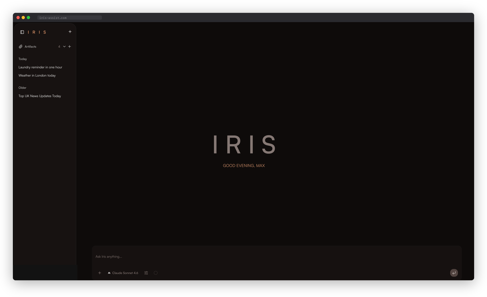
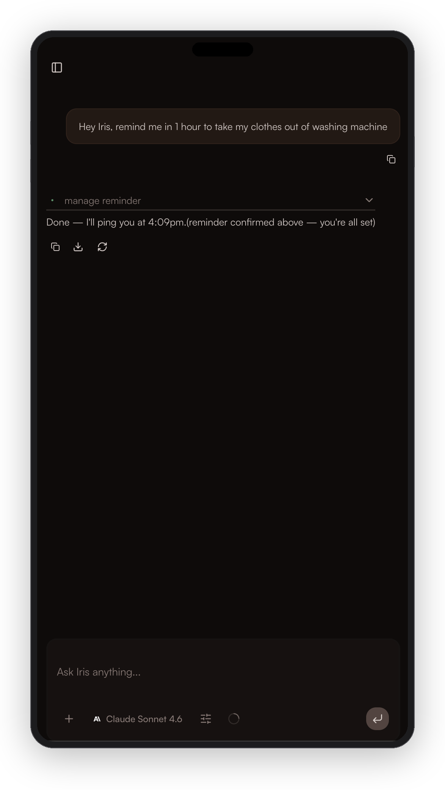
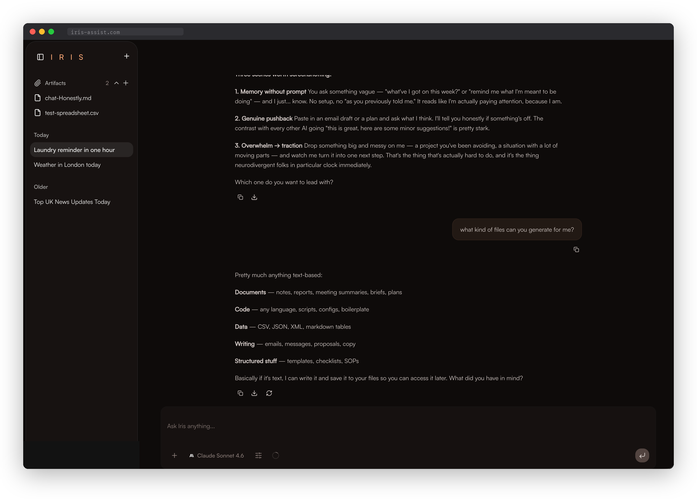
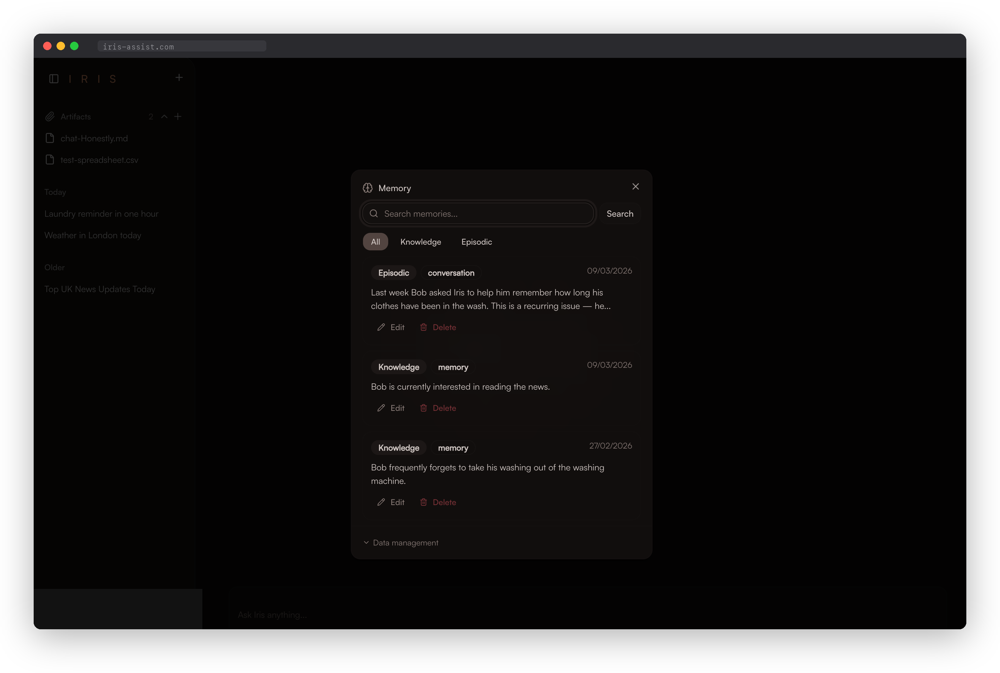
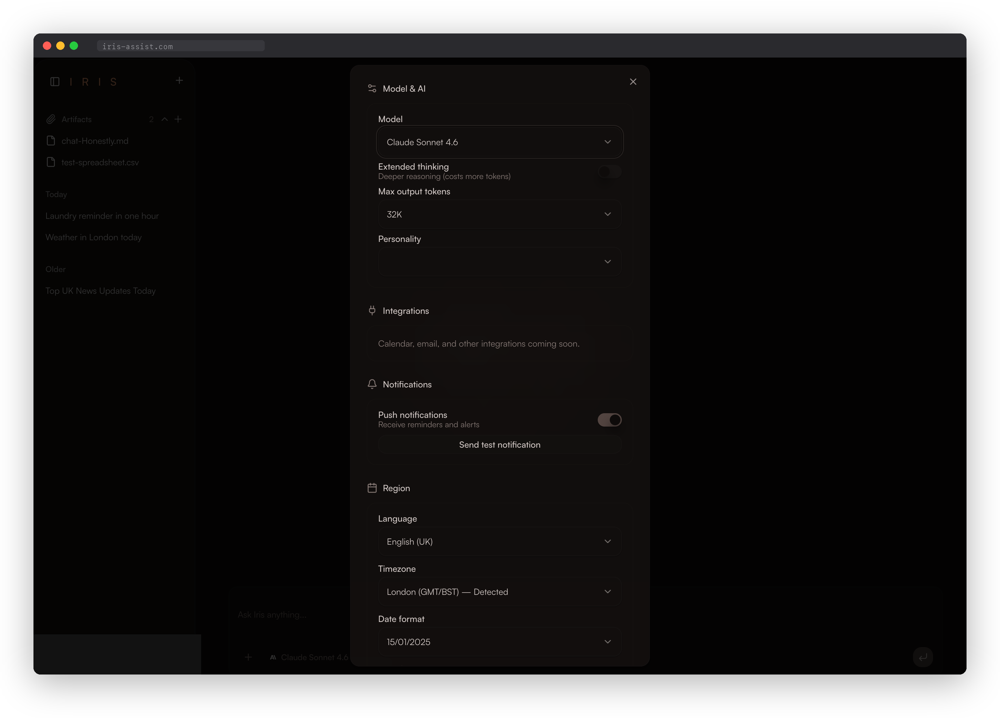

<h1 align="center">IRIS</h1>

<p align="center">An open-source AI productivity partner that actually keeps up with you.</p>

<br />

<p align="center">
  <a href="#get-iris-running">Get Started</a> &middot;
  <a href="docs/architecture.md">Architecture</a> &middot;
  <a href="docs/features.md">Features</a> &middot;
  <a href="https://github.com/maxymax92/IRIS-Productivity-Partner_v1.0/issues/new?template=bug_report.yml">Report Bug</a> &middot;
  <a href="https://github.com/maxymax92/IRIS-Productivity-Partner_v1.0/issues/new?template=feature_request.yml">Request Feature</a>
</p>

<p align="center">
  <a href="https://github.com/maxymax92/IRIS-Productivity-Partner_v1.0/blob/main/LICENSE"></a>
</p>

<br />

<table align="center">
  <tr>
    <td></td>
    <td></td>
  </tr>
</table>

<br />

---

Iris is a conversational AI with persistent memory, real tools, and a personality that adapts to yours. She remembers what you told her last month, notices when you keep dodging the same task, and won't give you ten options when you need one answer. She uses British English, she has opinions about your priorities, and she'll tell you your email draft is too long.

She's a PWA built on Next.js 16, powered by Claude, backed by Supabase, and fully self-hostable. Every layer — from the Postgres migrations to the streaming UI to the system prompt — is hand-authored and documented.

---

## What Iris does

<p align="center">
  
</p>

<br />

### She remembers things

Two-table system: permanent knowledge (`knowledge_embeddings`, pgvector) for facts that don't change, and episodic memory (`semantic_memory`) for session context that auto-expires. Write-time dedup at 0.85 cosine similarity so memory grows without bloating. Products like [Mem0](https://mem0.ai) and [Letta](https://www.letta.com/) do this as managed services — Iris rolls its own on Postgres because self-hosted means self-hosted, and because I wanted to understand the problem at the storage layer.

<p align="center">
  
</p>

### Actually does stuff

9 MCP tools (knowledge CRUD, files, projects, reminders, push notifications), 4 specialist subagents (researcher, memory-keeper, planner, reviewer), up to 100 tool-using turns per message. The agent searches the web, manages your files in Supabase Storage, logs context for future sessions, and stores things you mention proactively — without being asked. $5 budget cap per query, fail-closed rate limiting, full audit trail.

### Opinionated by design

The system prompt is ~160 lines of XML-structured behavioural protocols: voice calibration (warm, sharp, a little cheeky), banned phrases ("Great question!", "I'd be happy to help!"), support protocols for when you're stuck (offers a 2-minute first step, narrows choices to two, flags unrealistic time estimates), and a priority hierarchy. It adapts to your energy — short terse messages get short answers, detailed sharing gets matched. See [`lib/agent/prompt.ts`](supabase/next/lib/agent/prompt.ts).

### Everything streams

Token-by-token streaming via Vercel AI SDK, 20+ message part types (reasoning blocks, tool calls with approval UI, code blocks with lazy Shiki highlighting, live JSX preview, terminal output, schema display, plans, stack traces, inline citations), multimodal input (images, PDFs, Office docs via `officeparser`), extended thinking with adaptive budget per model.

### The UI

OKLCH colour tokens with three-tier glass utilities (`glass-card`, `glass-panel`, `glass-subtle`), progressive surface elevation, `touch:` custom variant for 44px touch targets on mobile, `prefers-reduced-motion` and `prefers-reduced-transparency` media queries, safe-area insets for iPhone notch/Dynamic Island, `dvh` for mobile browser chrome. 24 ai-element compound components, shadcn/ui throughout.

### Works everywhere

Settings, conversations, and notifications sync in real time via Supabase Realtime. Push notifications through Web Push with VAPID, service worker, and a reminder chain: `pg_cron` → `pg_net` → `reminder-check` edge function → `push-send` → Web Push API. Dead subscriptions auto-cleaned.

<p align="center">
  
</p>

---

## Under the hood

### Two SDKs, one bridge

The Claude Agent SDK (0.2.x, still early) handles agentic orchestration — tool loops, subagents, hooks, session persistence. The Vercel AI SDK handles streaming UI — `useChat`, message accumulation, transport. Neither does what the other does. A custom stream adapter (`stream-adapter.ts`) translates between their protocols.

Most of the complexity is in edge cases. Subagent stream events are filtered by `parent_tool_use_id` — without this, unrecognised tool call IDs crash the client. A `didMainTurnStream` boolean tracks whether the main agent turn delivered text via deltas, because post-subagent continuations arrive as finalised messages that silently vanish without it. Keepalive heartbeats go out every 10s during long subagent work to stop Railway killing the connection. The stream adapter wraps keepalive writes in try/catch for closed streams, and there's a 2-second auto-reload on streaming→ready that recovers from the database.

### How memory actually works

Session bootstrapping semantic-searches the user's first message and injects relevant memories into the system prompt (I tried "5 most recent memories" first — user asks about a work meeting, gets grocery shopping context). After the Agent SDK compacts a long conversation, a hook re-injects memory tool awareness, because otherwise the agent forgets it can remember things. 384-dim vectors from Supabase Edge AI's `gte-small` model, HNSW indexes, no external API calls.

### Hooks

Nine hook events: PreToolUse, PostToolUse, PermissionRequest, PostToolUseFailure, Stop, SubagentStart, SubagentStop, SessionStart, PreCompact. Rate limiting is fail-closed (Postgres RPC errors = tool denied, not allowed). Human-in-the-loop tool approval through a Promise-based registry — the hook blocks, the user taps Approve or Deny, 2-minute auto-deny. Cross-request sync in a stateless server, no WebSockets. Session resume degrades gracefully — corrupted session file gets cleared, state resets, retries fresh. User messages are persisted before the agent runs so nothing's lost if it crashes.

### Stuff I learned the hard way

Token usage metadata arrives via the stream, but the auto-reload replaces in-memory messages with DB-loaded ones that don't carry it. `usePreservedUsage` snapshots the data during render before it's gone (React's setState-during-render). IME composition handling to stop Enter submitting during CJK input. Blob URL lifecycle management to prevent memory leaks. One migration (`simplify_file_history`) explicitly rolls back my own over-engineering — a git-like branching model became a simple audit log because the original was more complexity than the feature needed.

---

## Stack

| Layer | Core | Details |
| :--- | :--- | :--- |
| Frontend | Next.js 16, App Router, Turbopack | React 19, TypeScript 6.0 beta |
| AI | Claude Agent SDK 0.2.x | Vercel AI SDK 6.0, Tailwind CSS v4 (OKLCH tokens) |
| Backend | Supabase | Postgres 17, pgvector, pg_cron, pg_net, Deno 2 edge functions |
| Deploy | Railway (standalone output) | PWA with Web Push |

---

## Get Iris running

You need **Node.js 20+**, the **[Supabase CLI](https://supabase.com/docs/guides/cli/getting-started)**, a **[Supabase](https://supabase.com)** project, and an **[Anthropic API key](https://console.anthropic.com)**.

```bash
git clone https://github.com/maxymax92/IRIS-Productivity-Partner_v1.0.git
cd IRIS-Productivity-Partner_v1.0

npm install

cp .env.example .env.local
# Fill in: Supabase URL, publishable key, secret key, Anthropic API key

npx supabase link --project-ref your-project-ref
npx supabase db push

npx supabase functions deploy embed --no-verify-jwt
npx supabase functions deploy memory --no-verify-jwt
npx supabase functions deploy push-send --no-verify-jwt
npx supabase functions deploy reminder-check --no-verify-jwt

npm run dev
```

Open `http://localhost:3000`

---

## Project structure

```
supabase/
├── migrations/                              17 migrations
├── functions/                               4 edge functions + _shared/ module layer
│   ├── memory/                              dual-table CRUD + unified semantic search
│   ├── embed/                               gte-small (384-dim, on-device)
│   ├── push-send/                           Web Push + dead subscription cleanup
│   └── reminder-check/                      cron-triggered recurrence engine
└── next/
    ├── app/api/chat/route.ts                ~830 lines
    ├── lib/agent/
    │   ├── prompt.ts                        the personality
    │   ├── tools.ts                         9 MCP tools
    │   ├── hooks.ts                         9 hook events
    │   ├── subagents.ts                     4 specialists
    │   ├── stream-adapter.ts                the SDK bridge
    │   └── approval-registry.ts             Promise-based tool approval
    └── components/
        ├── chat/chat-view.tsx               chat orchestrator + stream recovery
        ├── chat/message-part-renderer.tsx    20+ part types
        ├── ai-elements/                     24 compound components
        └── ui/                              shadcn/ui
```

---

## Contributing

Fork it, branch it, run `npm run gate:ci` (ESLint + Deno lint + typecheck + Prettier — all clean or it doesn't merge), PR it. [CONTRIBUTING.md](CONTRIBUTING.md) has the rest.

## Docs

- [`docs/architecture.md`](docs/architecture.md) — ~1,000-line architecture spec with Mermaid diagrams, 5-phase message lifecycle, and trade-off rationale
- [`docs/features.md`](docs/features.md) — every feature documented: chat, memory, files, notifications, design system, auth, locale
- [`SECURITY.md`](SECURITY.md) — vulnerability reporting

---

<p align="center">
  <a href="https://github.com/maxymax92/IRIS-Productivity-Partner_v1.0/blob/main/LICENSE">MIT</a> — Copyright (c) 2025-2026 Iris Contributors
</p>
