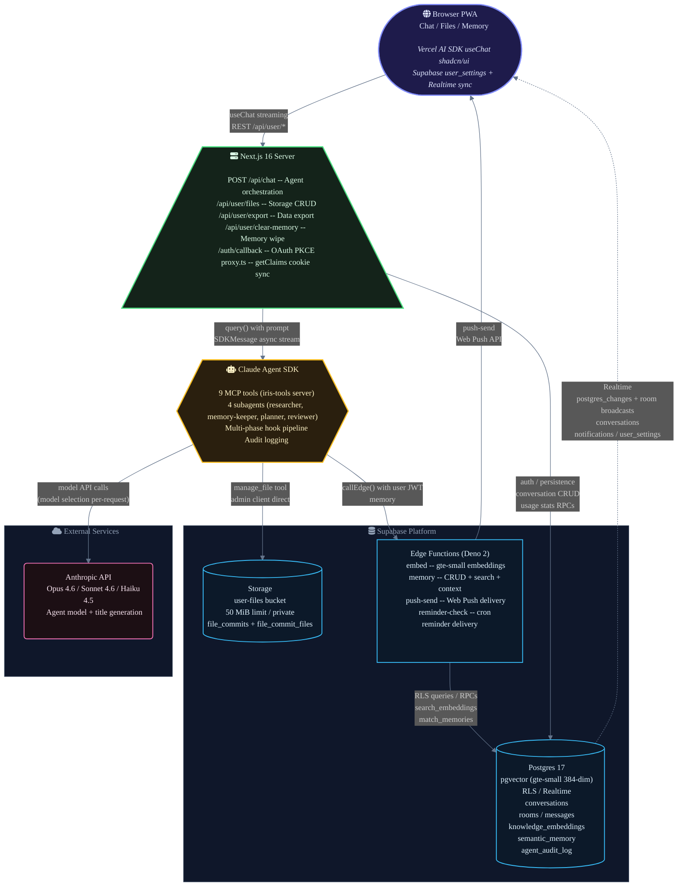
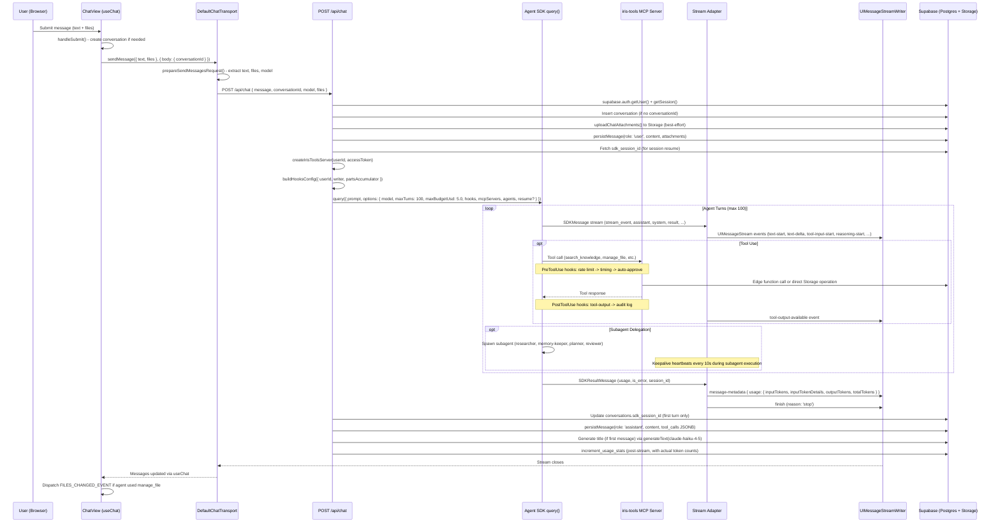

# Iris V2 Architecture

---

## System Architecture

Iris is an AI-powered productivity guardian — a PWA with two surfaces, **Chat** and **Files**, that manages knowledge, remembers context across conversations, and handles file operations through natural language. A split-brain AI design drives the architecture: the **Claude Agent SDK** orchestrates tools, subagents, and hooks server-side, while the **Vercel AI SDK** streams UI on the client. The agent reads and writes to Supabase through MCP tools, maintains dual-table semantic memory with pgvector embeddings, and delegates specialized work to purpose-built subagents.

### System Architecture Diagram



---

### Architecture Deep Dive

#### Browser PWA Layer

The client is a **Next.js 16** (`^16.1.6`) app running **React 19** (`^19.2.4`) with **Turbopack** for development. It ships as a PWA with full mobile viewport configuration (`userScalable: false`, `viewportFit: cover`, dark theme color `#1f1b16`). The UI stack layers three tiers: SDK/provider components first (Vercel AI SDK's `useChat` for streaming chat), then **shadcn/ui** (32 components, `radix-nova` style with `stone` base color in OKLCH tokens), then raw Tailwind CSS v4 with semantic design tokens -- never hardcoded colors.

Key client libraries: **motion** (`^12.34.3`) handles animations, **streamdown** (`^2.3.0`) with plugins (`@streamdown/code`, `@streamdown/mermaid`, `@streamdown/math`, `@streamdown/cjk`) renders streaming markdown, and **shiki** (`^3.23.0`) provides syntax highlighting in code blocks. Client state is managed by **`useUserSettings()`**, a React Context provider backed by the Supabase `user_settings` table with Realtime sync. Settings include model selection, thinking mode, timezone, language, date/time format, active tab, and conversation IDs. Debounced writes (500ms) handle rapid UI state changes; preference changes write immediately. Cross-device sync is provided by a Supabase Realtime subscription on the `user_settings` table.

The Vercel AI SDK (`ai@^6.0.100`, `@ai-sdk/react@^3.0.96`, `@ai-sdk/anthropic@^3.0.46`) is used **exclusively on the frontend** for consuming the streaming `UIMessageStream` protocol. It handles `useChat` hook lifecycle, message part rendering (text, reasoning, tool calls with input/output), and usage metadata display. It never makes direct Anthropic API calls -- that's the server's job.

#### Next.js Server Layer

The server runs in **standalone output mode** for Railway deployment, with `outputFileTracingRoot` set to the monorepo root (`../../`) so the standalone build captures the full dependency tree. TypeScript configuration is strict: **TypeScript 6.0.0-beta** with `exactOptionalPropertyTypes`, `noUncheckedIndexedAccess`, `noPropertyAccessFromIndexSignature`, and `verbatimModuleSyntax` all enabled. The `reactCompiler` is explicitly disabled.

**API surface:**

- **`POST /api/chat`** -- The main agent endpoint. Authenticates via Supabase `getUser()`, extracts the access token from the session, builds multimodal content blocks from text + file attachments (images and PDFs via base64 data URLs), and calls `query()` from `@anthropic-ai/claude-agent-sdk@^0.2.50`. Session resumption is enabled via `sdk_session_id` stored on the `conversations` table -- on subsequent messages in the same conversation, the handler passes `resume` to `query()` for full conversation continuity. If resume fails (missing or corrupted session file), the handler clears the stale ID and retries with a fresh session. The response is a `UIMessageStream` created by `createUIMessageStreamResponse` from the Vercel AI SDK, bridged from the Agent SDK's `AsyncIterable<SDKMessage>` by `pipeAgentStreamToWriter`.
- **`GET/POST/DELETE /api/user/files`** -- File management. GET returns a tree structure or signed URLs, POST handles multipart uploads and folder creation, DELETE handles recursive folder deletion. All operations record `file_commits` as flat artifacts (no git history in UI, though `createFileCommit` still works).
- **`/api/user/export`** -- Data export.
- **`/api/user/clear-memory`** -- Memory wipe.
- **`POST /api/user/test-push`** -- Sends a test push notification to the authenticated user's subscribed devices. Inserts a system notification and triggers the `push-send` edge function.
- **`/auth/callback`** -- OAuth PKCE code exchange. Handles the Google OAuth redirect, exchanges the authorization code for a session, and redirects to the app.

**Auth proxy** (`proxy.ts`): Every non-static request passes through `updateSession()` which creates a Supabase server client, calls `getClaims()` for local JWT validation (no network hop to Supabase Auth), and syncs cookies on the response. This is the lightweight auth gate -- the heavy `getUser()` validation happens in individual route handlers that need full user context.

#### Agent SDK Layer

The **Claude Agent SDK** (`@anthropic-ai/claude-agent-sdk@^0.2.50`) runs server-side in `POST /api/chat`. It provides multi-turn agentic loops (up to 100 turns), MCP tool servers, subagent delegation, a hook lifecycle, session persistence, and budget controls ($5.00 max per query) — capabilities the Vercel AI SDK lacks.

**MCP Tools:** Nine tools on a single MCP server (`iris-tools`), created by `createSdkMcpServer`:

| Tool | Routing | Description |
| :--- | :--- | :--- |
| `search_knowledge` | `POST /functions/v1/memory/search` via `callEdge` | Semantic search across both knowledge and episodic memory tables |
| `store_memory` | `POST /functions/v1/memory` via `callEdge` | Create a new long-term memory with auto-embedding; create-only |
| `update_memory` | `PATCH /functions/v1/memory/:id` via `callEdge` | Update an existing memory's content, type, or metadata with re-embedding |
| `delete_memory` | `DELETE /functions/v1/memory/:id` via `callEdge` (knowledge) or admin client (episodic) | Permanently delete a stale, incorrect, or duplicate memory |
| `log_context` | `POST /functions/v1/memory/context` via `callEdge` | Write episodic context with importance scoring and optional expiry |
| `manage_file` | Admin client direct to Supabase Storage | Upload, download, list, delete in `user-files` bucket with commit logging |
| `manage_project` | Direct Supabase queries via admin client | Full CRUD for projects (list, get, create, update, delete) |
| `manage_reminder` | Direct Supabase queries via admin client | Create, list, update, snooze, dismiss, and delete scheduled reminders with snooze tracking |
| `send_notification` | Direct insert into `notifications` table | Creates immediate push notifications with custom title and body |

All edge function calls go through `callEdge()`, which sends HTTP requests to `${SUPABASE_URL}/functions/v1/${path}` with the **user's JWT** as `Bearer` token. File, project, reminder, and notification operations use the service-role admin client directly. The SDK also exposes `WebSearch`, `WebFetch`, and `Task` alongside the MCP tools. Server filesystem tools have been removed — all file I/O routes through `manage_file` to Supabase Storage.

**Subagents:** Four specialized subagents:

| Subagent | Model | Tools | Purpose |
| :--- | :--- | :--- | :--- |
| `researcher` | Sonnet | WebSearch, WebFetch, manage_file | Multi-source web research with cross-referencing and optional file output |
| `memory-keeper` | Sonnet | search_knowledge, store_memory, update_memory, delete_memory | Bulk memory curation, deduplication, and cleanup |
| `planner` | Sonnet | search_knowledge, manage_project, log_context | Task decomposition, planning, and momentum building |
| `reviewer` | Sonnet | search_knowledge, manage_reminder, log_context | Daily reviews, weekly reflections, and gentle accountability |

**Hook Pipeline:** Ordered callback matchers on nine lifecycle events govern agent behavior:

1. **`PreToolUse`** -- Rate limit via `consume_rate_limit_token` RPC, timing records start time, auto-approve whitelists all Iris MCP tools.
2. **`PostToolUse`** -- Streams results to UI via `UIMessageStreamWriter`; logs tool name, input, output, execution time, and permission to `agent_audit_log`.
3. **`PermissionRequest`** -- User approval flow for sensitive tools — blocks until the client responds via the approval registry.
4. **`PostToolUseFailure`** -- Logs failed executions with error details.
5. **`SessionStart`** -- On `source === 'compact'`, injects `additionalContext` reminding the agent about memory tools so it re-retrieves context lost during compaction.
6. **`Stop`** -- Logs session completion.
7. **`SubagentStart/SubagentStop`** -- Observability logging.
8. **`PreCompact`** -- Logs context compaction events.

All tools auto-approve immediately — every tool writes to RLS-protected Supabase, and server filesystem tools have been removed.

**Stream Adapter** (`stream-adapter.ts`): Bridges the Agent SDK's `AsyncIterable<SDKMessage>` to the Vercel AI SDK's `UIMessageStreamWriter`. Handles `stream_event` messages (content block start/delta/stop for text, tool use, and thinking blocks), `assistant` messages (finalized turns), `result` messages (usage metadata forwarding), and `system` messages (compaction notifications, subagent status). A `PersistedPart` accumulator captures tool call inputs, outputs, and reasoning blocks for database persistence as JSONB. Returns `{ sessionId, text, usage }` where `usage` is an `AgentQueryUsage` object containing `inputTokens`, `outputTokens`, `cacheReadInputTokens`, `cacheCreationInputTokens`, `totalCostUsd`, and `numTurns`.

#### Supabase Platform Layer

**Postgres 17** with pgvector extension stores all application data behind row-level security (RLS). The database schema spans 17 local migrations plus additional remote migrations applied via Supabase MCP, and includes:

- **`conversations`** + **`conversation_messages`** -- Chat persistence with `sdk_session_id` (used for Agent SDK session resumption) and `tool_calls` JSONB for non-text part storage.
- **`knowledge_embeddings`** -- Long-term RAG knowledge base. Stores content with `gte-small` 384-dimensional embeddings (HNSW index). Unique constraint on `(user_id, source_id)` prevents duplicate embeddings. `project_id` FK column for project-scoped filtering. Browsable in UI.
- **`semantic_memory`** -- Episodic context with `importance` scoring (0-1), `memory_type` enum (`fact`, `conversation`, `task`, `project`, `preference`), optional `expires_at` for expiry, and `project_id` FK column for project scoping. Expired rows are deleted daily by a `pg_cron` job. Browsable in UI.
- **`agent_audit_log`** -- Every tool execution logged with input, output, permission decision, execution time, and errors. Auto-pruned after 90 days via pg_cron.
- **`file_commits`** + **`file_commit_files`** -- File activity log for file operations (flat artifacts, no git history exposed in UI).
- **`usage_stats`** -- Per-user daily aggregated usage (input/output tokens, API calls, session time).

**Supabase Storage** hosts the `user-files` bucket (private, 50 MiB file size limit) with per-user path isolation (`user_id/` prefix).

**Edge Functions** (Deno 2) provide the business logic layer between the agent and the database. There are four functions plus a shared module:

| Function | Purpose |
| :--- | :--- |
| `embed` | Generates 384-dim embeddings using Supabase Edge AI's `gte-small` model |
| `memory` | CRUD for both knowledge_embeddings and semantic_memory stores + semantic search. Routes: `/search` (merged semantic search across both tables), `/context` (episodic memory write), root POST (knowledge write), GET/DELETE for browsing |
| `push-send` | Web Push delivery for pending notifications using `@negrel/webpush` |
| `reminder-check` | Processes due reminders on a cron schedule -- creates notifications for pending/snoozed reminders whose time has passed, handles recurrence, and triggers `push-send` for delivery |

All functions share a `_shared/` module providing `requireAuth()` (JWT validation via `supabase.auth.getUser(token)`), CORS handling, embedding generation, error formatting, and a typed Supabase client factory. Every function has `verify_jwt = false` in `config.toml` because Supabase's relay-level JWT verification is incompatible with asymmetric JWT Signing Keys (ES256) -- all auth is handled internally.

#### External Services

**Anthropic API** is the sole external AI provider. Three model tiers are configured:

| Model | Context | Max Output | Role |
| :--- | :--- | :--- | :--- |
| Claude Opus 4.6 | 200K | 128K | Available for complex reasoning |
| Claude Sonnet 4.6 | 200K | 64K | Default agent model, all subagents (researcher, memory-keeper, planner, reviewer) |
| Claude Haiku 4.5 | 200K | 64K | Title generation |

The model is selectable per-request from the client, validated by `isValidModelId()` against the `MODELS` registry. Defaults to `claude-sonnet-4-6` (overridable via `AGENT_MODEL` env var). Title generation uses `claude-haiku-4-5-20251001` via the Vercel AI SDK's `generateText`.

---

### Key Data Flows

#### Chat

User sends a message (optionally with image/PDF attachments as base64 data URLs) to `POST /api/chat`. The route persists the user message, writes a truncated summary (100 chars) to `conversations.summary` as a sidebar fallback, fetches the user's locale preferences (`language`, `timezone`, `date_format`, `time_format`) from `user_settings` and injects them as a `<user_locale>` block in the system prompt, builds an `iris-tools` MCP server with the user's JWT, and calls Agent SDK `query()`. The agent may execute up to 100 tool-using turns -- each tool call flows through the hook pipeline (safety check, rate limit, audit) before executing against edge functions or storage. The stream adapter translates `SDKMessage` events into `UIMessageStream` protocol events, which React renders incrementally. After streaming completes, the assistant response (including tool calls and reasoning blocks as JSONB) is persisted, and a title is auto-generated if this is a new conversation.

#### Push Notifications

The agent can send immediate custom notifications via the `send_notification` tool. The `push-send` function delivers these to all the user's subscribed devices via Web Push API. Client-side, `usePushNotifications()` handles service worker registration, permission management, and subscription lifecycle. The service worker (`sw.js`) displays notifications and routes clicks to the appropriate app view. Notification types include `reminder`, `mention`, `system`, and `achievement`.

#### Memory

Content enters the dual-table memory system through two paths: the `store_memory` tool writes to `knowledge_embeddings` (permanent facts), and the `log_context` tool writes to `semantic_memory` (episodic context with optional expiry). Both memory stores are browsable in the UI. All embeddings are 384-dimensional vectors generated by Supabase Edge AI's `gte-small` model. Retrieval via `search_knowledge` queries both tables simultaneously through a merged RPC, returning results ranked by cosine similarity with `created_at` metadata for freshness assessment. The memory edge function handles CRUD for both stores plus semantic search. On every new conversation, `buildMemoryContext()` in `route.ts` searches for memories relevant to the user's first message and injects them as a `<user_context>` block in the system prompt. After context compaction, the `SessionStart` hook (triggered with `source: 'compact'`) injects a reminder about memory tools so the agent re-retrieves context lost during summarisation. Expired `semantic_memory` rows are automatically cleaned daily via `pg_cron`.

#### Files

Users upload and manage files through two paths: the `manage_file` MCP tool (agent-initiated, uses admin client directly against Supabase Storage) and the `/api/user/files` REST endpoint (UI-initiated, uses the user's authenticated Supabase client). File management is flat artifacts -- no git history is exposed in the UI, though `createFileCommit` still records entries internally. The UI renders a file tree built from recursive Storage listing, with signed URL generation for preview/download.

#### Auth

Sign-in supports Google OAuth PKCE, email/password, and magic links. Signup is gated by an `allowed_emails` table. Every request passes through `proxy.ts` which calls `getClaims()` for fast local JWT validation (no network roundtrip). The OAuth flow redirects through `/auth/callback` which exchanges the authorization code for a session via `exchangeCodeForSession`. The agent gets the user's access token from the active session in `route.ts` and passes it to `callEdge()` for edge function calls -- edge functions then independently validate the JWT via `requireAuth()` -> `supabase.auth.getUser(token)`.

---

### Long-term Vision

- **Open-source, self-hosted:** Users clone the repo, bring their own keys, and run Iris as a desktop app, self-hosted web, or both — especially valuable for users who want full control over their data and workflow.
- **Electron desktop app** with Cursor-style IDE experience: local file storage, git versioning, codebase management, agentic coding and artifact generation. Supabase Storage complements the desktop for web access.
- **Integrations:**
  - Critical: Google Mail, Calendar, Drive, GitHub
  - P1: Linear, Slack, Custom MCPs, Obsidian
  - P2: NHS app, Apple Health, Strava, Amazon, Zoom, Outlook

---

## The Chat Message Lifecycle

A five-phase pipeline transforms each user message into a persistent, streamed AI response. The **Agent SDK** orchestrates tools and subagents server-side; the **Vercel AI SDK** renders the stream client-side. A custom **stream adapter** bridges the two protocols.

### Sequence Diagram



---

### Phase 1: Client Preparation

Everything starts in **`ChatView`** (`components/chat/chat-view.tsx`). The component wires up Vercel AI SDK's `useChat` hook with a **`DefaultChatTransport`** configured to rewrite outbound requests.

**Message construction.** When the user hits send, `handleSubmit` receives a `PromptInputMessage` containing `text` and `files`. If no active conversation exists, it calls `createConversation()` first (which inserts a row into `conversations` via the Supabase client and persists the new ID to the `user_settings` table via `useUserSettings()`), then calls `sendMessage`.

**Transport rewriting.** The `prepareSendMessagesRequest` callback on `DefaultChatTransport` intercepts the outbound payload. Instead of sending the full Vercel AI SDK message array, it extracts the **last user message**, pulls out text parts and file parts separately, and constructs a flat request body:

```typescript
{
  message: string,          // concatenated text parts
  conversationId: string,   // from merged body
  model: string,            // from useUserSettings() context
  files?: { url: string, mediaType: string }[]  // base64 data URLs
}
```

**Model selection.** The active model is derived directly from `useUserSettings().settings.model_id`, cross-checked against the `MODELS` array. If the persisted ID is stale, it falls back to `MODELS[0]` (Claude Opus 4.6). The model picker in the input footer updates the setting via `useUserSettings().update({ model_id })`.

**Multimodal attachments.** Files are picked via `PromptInputActionAddAttachments`, managed by `usePromptInputAttachments()`, and sent as base64 data URLs with their MIME type and filename. Supported formats: JPEG, PNG, GIF, WebP (images), PDF (documents), text files (markdown, CSV, JSON, HTML, code, etc.), and Office documents (DOCX, XLSX, PPTX, ODT, ODS, ODP — parsed via `officeparser`).

---

### Phase 2: Server Setup

The **`POST /api/chat`** handler (`app/api/chat/route.ts`) has a `maxDuration` of **300 seconds** (5 minutes, to support up to 100 agent turns).

**Authentication.** Two Supabase calls: `auth.getUser()` for the user ID, `auth.getSession()` for the JWT access token. The access token is passed to tool handlers that call edge functions on the user's behalf.

**Conversation resolution.** If no `conversationId` arrives in the body, the handler creates one via `supabase.from('conversations').insert()`. The user message is immediately persisted to `conversation_messages` via `persistMessage()` -- this happens **before** the agent runs, so even if the agent crashes, the user's message is saved. When files are attached, `uploadChatAttachments()` uploads them to `user-files` storage at `{userId}/chat-attachments/{conversationId}/{timestamp}-{sanitisedFilename}` (best-effort, individual failures are skipped) and the resulting `PersistedAttachment[]` metadata is saved to the `attachments` JSONB column. On reload, `loadMessages()` reconstructs `FileUIPart`s by batch-generating signed URLs via `createSignedUrls()`.

**Session resume.** The Agent SDK persists sessions as JSONL transcripts to `~/.claude/projects/` (default behaviour with `persistSession: true`). On Railway, `SESSION_VOLUME_PATH` overrides `HOME` to a persistent volume (`/data`) so session files survive container restarts. On subsequent messages in the same conversation, the handler reads `sdk_session_id` from the `conversations` table and passes it as `resume` to `query()`, giving the agent full conversation context. If resume fails (missing or corrupted session file), the handler clears the stale `sdk_session_id`, resets the `partsAccumulator`, and retries with a fresh session -- the conversation loses agent memory for that turn but does not break permanently.

**Content block assembly.** For multimodal messages, `buildContentBlocks()` (async) converts files into Anthropic API content blocks by MIME type: images → `ImageBlockParam` (base64), PDFs → `DocumentBlockParam` (`Base64PDFSource`), text files (all `text/*` plus `application/json`, `application/xml`, etc.) → decoded from base64 to UTF-8 string → `DocumentBlockParam` (`PlainTextSource`), Office documents (DOCX/XLSX/PPTX/ODT/ODS/ODP) → text extracted via `officeparser` → `DocumentBlockParam` (`PlainTextSource`). Text content is truncated at 500KB. Empty files are skipped. The user's text is always appended as a `TextBlockParam`. Unsupported file types are logged and noted in the text block. For multimodal messages, `createUserMessageStream()` yields a single `SDKUserMessage` with these content blocks. For text-only messages, the raw string is passed directly as the `prompt`.

---

### Phase 3: Agent Orchestration

The core of the backend is a single call to the Agent SDK's **`query()`** function, which returns an `AsyncIterable<SDKMessage>`.

#### Configuration

The query options are assembled in `baseQueryOptions`:

| Parameter | Value | Purpose |
| :--- | :--- | :--- |
| `systemPrompt` | `IRIS_SYSTEM_PROMPT` (plain string) | Iris personality, memory protocol, and tool usage instructions -- no Claude Code preset |
| `model` | Client-selected or `AGENT_MODEL` env var (default: `claude-sonnet-4-6`) | The LLM driving the agent |
| `maxTurns` | **100** | Hard cap on agentic loops -- prevents infinite tool-call cycles |
| `maxBudgetUsd` | **$5.00** | Per-query cost ceiling -- prevents runaway costs |
| `includePartialMessages` | `true` | Enables streaming of partial content blocks |
| `permissionMode` | `'acceptEdits'` | Non-interactive mode -- auto-accepts edits (no interactive prompts on server) |
| `settingSources` | `[]` | SDK isolation -- no filesystem settings loaded on server |
| `persistSession` | `true` (default) | SDK writes JSONL session transcripts; `resume` loads previous session for conversation continuity |
| `env` | `{ ...process.env, HOME: volumePath }` | Overrides `HOME` to persistent volume on Railway so session files survive restarts |
| `allowedTools` | `['WebSearch', 'WebFetch', 'Task'] + 9 MCP tools` | No server filesystem tools -- all file I/O through Supabase Storage |
| `mcpServers` | `{ 'iris-tools': irisToolsServer }` | MCP server exposing Iris-specific tools |
| `agents` | `IRIS_SUBAGENTS` (researcher, memory-keeper, planner, reviewer) | Delegatable specialist subagents |

#### MCP Tools

The nine `iris-tools` are detailed in the Architecture Deep Dive and Agent Architecture sections. Memory tools route through edge functions via `callEdge()` with the user's JWT; `manage_file`, `manage_project`, `manage_reminder`, and `send_notification` use the admin client directly.

#### Subagents

Four specialists with `maxTurns` limits (see Architecture Deep Dive and Subagents sections for full details): **researcher** (10), **memory-keeper** (5), **planner** (8), **reviewer** (8).

#### Hook System

`buildHooksConfig()` assembles a layered pipeline (see Hook System section for full details):

- **PreToolUse** (ordered): rate limiting (fail-closed) -> execution timing -> auto-approve
- **PostToolUse**: stream tool output + capture for persistence + audit log (fire-and-forget)
- **PermissionRequest**: user approval for sensitive tools (blocks until client responds)
- **PostToolUseFailure**: log errors to audit table
- **SessionStart**: post-compaction memory tool re-injection
- **Stop/SubagentStart/SubagentStop/PreCompact**: observability logging

---

### Phase 4: Stream Bridge

**`pipeAgentStreamToWriter()`** (`lib/agent/stream-adapter.ts`) consumes the Agent SDK's `AsyncIterable<SDKMessage>` and translates each message into Vercel AI SDK `UIMessageStream` events.

#### Subagent Stream Filtering

All `stream_event` messages with `parent_tool_use_id !== null` are discarded at the top of the switch case. Subagent events must never reach the UI writer -- they would register tool call IDs that the client doesn't expect, and when the `PostToolUse` hook later writes `tool-output-available` for those IDs, the Vercel AI SDK's `processUIMessageStream` throws a `UIMessageStreamError` ("No tool invocation found"). Subagent results instead surface via `task_notification` / `task_progress` system messages, which are rendered as inline text snippets.

#### Event Mapping

The adapter processes messages in a `for await` loop (parent-agent events only):

| SDKMessage type | Stream event | UIMessageStream output |
| :--- | :--- | :--- |
| `stream_event` + `content_block_start` (text) | `text-start` | `{ type: 'text-start', id }` |
| `stream_event` + `content_block_delta` (text_delta) | `text-delta` | `{ type: 'text-delta', id, delta }` |
| `stream_event` + `content_block_stop` (text) | `text-end` | `{ type: 'text-end', id }` |
| `stream_event` + `content_block_start` (tool_use) | `tool-input-start` | `{ type: 'tool-input-start', toolCallId, toolName }` |
| `stream_event` + `content_block_delta` (input_json_delta) | `tool-input-delta` | `{ type: 'tool-input-delta', toolCallId, inputTextDelta }` |
| `stream_event` + `content_block_stop` (tool_use) | `tool-input-available` | `{ type: 'tool-input-available', toolCallId, toolName, input }` |
| `stream_event` + `content_block_start` (thinking) | `reasoning-start` | `{ type: 'reasoning-start', id }` |
| `stream_event` + `content_block_delta` (thinking_delta) | `reasoning-delta` | `{ type: 'reasoning-delta', id, delta }` |
| `stream_event` + `content_block_stop` (thinking) | `reasoning-end` | `{ type: 'reasoning-end', id }` |
| `assistant` | (conditional) | Writes text snippet only if NOT already streamed via deltas |
| `result` | `message-metadata` + `finish` | Usage stats forwarded, then stream finishes |
| `system` (status: compacting) | `text-start/delta/end` | "_Summarising conversation..._" |
| `system` (task_started) | `text-start/delta/end` | "_Starting: {description}_" |
| `system` (task_progress) | `text-start/delta/end` | "_Progress: {description} ({last_tool_name})_" |
| `system` (task_notification) | `text-start/delta/end` | "_Completed: {summary}_" |
| `tool_use_summary` | `text-start/delta/end` | Summary text snippet |
| `tool_progress` | `text-start/delta/end` | Italic working status: "_Working: {tool_name} ({elapsed}s)..._" |
| `rate_limit` | `text-start/delta/end` | Warning with retry timer: "_Rate limited -- retrying in {N}s..._" |
| `prompt_suggestion` | `data-prompt-suggestions` | Forwarded as `data-prompt-suggestions` data part with suggestions array |
| `user`, `auth_status` | (ignored) | No UI output |

#### Part ID Generation

Each content block gets a sequential ID via `nextId(prefix)` -- e.g., `text-1`, `reasoning-2`, `text-3`. These IDs correlate `start`, `delta`, and `end` events for the same block.

#### Active Block Tracking

A `Map<number, ActiveBlock>` maps content block indices to their state (`id`, `blockType`, accumulated `inputJson` or `thinkingText`). This is necessary because the Agent SDK uses integer indices to correlate start/delta/stop events within a single message.

#### Tool Output Persistence

The `partsAccumulator` (a `Map<string, PersistedPart>`) collects tool calls and reasoning blocks for database persistence. Tool inputs are captured on `content_block_stop`; tool outputs are captured in the `PostToolUse` hook. The accumulator is keyed by `toolCallId` (for tool calls) or block ID (for reasoning blocks). The accumulator also serves as a **subagent guard** -- the `PostToolUse` tool output hook only writes `tool-output-available` to the UI writer if the `toolCallId` exists in the accumulator (meaning the tool call was actually streamed to the client). This prevents orphaned tool-output events for subagent tool calls that were never registered on the client side.

#### Unstreamed Text Handling

A `didMainTurnStream` boolean tracks whether the current main-agent turn delivered text via `stream_event` deltas. When an `assistant` message arrives with text but `didMainTurnStream` is `false` (happens with post-subagent continuations or non-streamed responses), the text is explicitly written to the UI via `writeTextSnippet`. Subagent messages (`parent_tool_use_id !== null`) are always skipped -- their results arrive through the `PostToolUse` hook's `tool-output-available` event.

#### Keepalive

A `setInterval` sends empty `message-metadata` events every **10 seconds** (`STREAM_KEEPALIVE_MS`) to prevent Railway/Cloudflare proxy timeouts during long-running subagent execution when no data flows to the client. Additionally, `task_progress` messages now generate visible text snippets during subagent runs, adding further traffic to keep connections alive.

#### Auto-Reload Recovery

The Vercel AI SDK's `safeEnqueue` silently catches errors when writing to a closed stream, meaning silent HTTP disconnects go undetected server-side. To recover, the client (`chat-view.tsx`) auto-reloads messages from the database 2 seconds after the `streaming → ready` status transition. This uses a separate `useEffect` (without `messages` in deps, so the timer survives render cycles) and handles race conditions via effect cleanup -- changing `status` (new user message) or `activeConversationId` (conversation switch) both trigger cleanup that clears the pending reload timer.

#### Usage Forwarding

When the `SDKResultMessage` arrives, the adapter writes `message-metadata` with `usage` containing `inputTokens`, `outputTokens`, `totalTokens`, and structured `inputTokenDetails` (`noCacheTokens`, `cacheReadTokens`, `cacheWriteTokens`) following the current Vercel AI SDK `LanguageModelUsage` type. The adapter also captures an `AgentQueryUsage` object with extended fields (`cacheReadInputTokens`, `cacheCreationInputTokens`, `totalCostUsd`, `numTurns`) and returns it alongside `sessionId` and `text` from `pipeAgentStreamToWriter()`. The client reads the stream metadata via `message.metadata.usage` to power the context meter.

---

### Phase 5: Post-Stream Persistence

After `pipeAgentStreamToWriter()` resolves, the handler performs a batch of persistence operations inside a try/catch (failures are logged but never crash the response, since the stream has already been sent to the client).

**Session ID persistence.** If the agent returned a new `sessionId` and the conversation doesn't already have one, it's saved to `conversations.sdk_session_id`. The `is('sdk_session_id', null)` guard ensures this only happens on the first turn.

**Assistant message persistence.** The accumulated text, `partsAccumulator`, and `usage` are passed to `persistAssistantResponse()` which calls `persistMessage()`. The `PersistedPart[]` array (tool calls with input/output + reasoning blocks) is serialized to the `tool_calls` JSONB column on `conversation_messages`. Token usage data (inputTokens, outputTokens, totalTokens, inputTokenDetails) is stored in the `metadata` JSONB column matching the Vercel AI SDK `LanguageModelUsage` shape, enabling the context meter to display usage after page reloads.

**Title generation.** If the conversation has no title (first exchange), `generateTitle()` calls `generateText()` with **Claude Haiku 4.5** (`TITLE_MODEL`), a max of **20 output tokens** (`TITLE_MAX_TOKENS`), and a prompt asking for a 6-word title. The result is capped to **60 characters** (`TITLE_MAX_LENGTH`). On failure, it falls back to truncating the user message to **50 characters** (`TITLE_FALLBACK_LENGTH`).

**Usage stats.** After the stream completes, `route.ts` calls `increment_usage_stats` RPC with actual token counts (`p_input_tokens`, `p_output_tokens`) from the `AgentQueryUsage` returned by `pipeAgentStreamToWriter()`. This moved from the Stop hook to post-stream processing because the Stop hook couldn't access the SDK's token usage data.

---

### The Architectural Decision

The Agent SDK / Vercel AI SDK split is deliberate. The Agent SDK provides multi-turn tool execution, session persistence, hooks, subagent delegation, budget limits, and turn caps — none of which exist in Vercel AI SDK's server-side primitives. The Vercel AI SDK provides `useChat` with streaming state management, message accumulation, transport abstraction, and the `UIMessage` parts model — rebuilding this would mean hundreds of lines of state management.

The cost is `pipeAgentStreamToWriter()`: every new Agent SDK message type needs a mapping, and every new Vercel AI SDK part type needs a rendering path in `MessagePartRenderer`. But using one SDK for both would sacrifice either the agentic backend or the streaming frontend.

---

## Agent Architecture

### Overview

`POST /api/chat` calls the Agent SDK's `query()` with MCP tools, subagents, and hooks. The agent runs up to **100 turns** (`AGENT_MAX_TURNS`) per query with a **$5.00 USD budget cap** (`AGENT_MAX_BUDGET_USD`). Default model: `claude-sonnet-4-6` (configurable via `AGENT_MODEL` env var, overridable per-request).

#### Agent Modules

| Module | Responsibility |
| :--- | :--- |
| `prompt.ts` | Personality prompt, runtime constants |
| `tools.ts` | MCP tool definitions, `callEdge` helper, server factory |
| `hooks.ts` | Hook factories, `buildHooksConfig` |
| `subagents.ts` | Subagent definitions |
| `stream-adapter.ts` | SDKMessage-to-UIMessageStream translation |
| `config.ts` | Barrel re-export for backward compatibility |

All modules live in `supabase/next/lib/agent/`.

---

### MCP Tools

Nine tools on the **`iris-tools`** MCP server, defined with Zod schemas via the Agent SDK's `tool()` function. `WebSearch`, `WebFetch`, and `Task` are also available; server filesystem tools have been removed.

#### 1. `search_knowledge`

**What it does:** Semantic similarity search across the user's entire knowledge base -- memories, facts, preferences, and files.

**Routing:** `callEdge('memory/search', 'POST', accessToken, ...)` -- calls the `memory` edge function's `/search` endpoint.

**Key parameters:**

- `query` (string, required) -- Natural language search query
- `contentType` (string, optional) -- Filter by type: `memory`, `fact`, `preference`, `context`, `conversation`, `file`
- `limit` (number, 1-50, default 10) -- Max results
- `threshold` (number, 0-1, default 0.5) -- Minimum similarity cutoff

**Returns:** Numbered list of matches with content type, similarity percentage, and content preview (truncated to `MAX_PREVIEW_LENGTH` = 200 chars). Searches **both** `knowledge_embeddings` and `semantic_memory` tables via merged RPC on the edge function side.

#### 2. `store_memory`

**What it does:** Creates a new entry in the user's long-term knowledge base with automatic semantic embedding. This is a create-only tool -- updates and deletes are handled by their own dedicated tools.

**Routing:** `callEdge('memory', 'POST', accessToken, ...)` -- calls the `memory` edge function.

**Key parameters:**

- `content` (string, required) -- The information to store (third person: "User prefers dark mode")
- `contentType` (string, default `'memory'`) -- Category: `memory`, `fact`, `preference`, `context`
- `sourceId` (UUID, optional) -- Links to a source record
- `sourceTable` (string, optional) -- Source table name
- `metadata` (Record, optional) -- Arbitrary key-value pairs
- `projectId` (UUID, optional) -- Associates the memory with a project

**Returns:** Confirmation with the stored memory's ID. Writes to the `knowledge_embeddings` table, where the edge function generates a 384-dim `gte-small` embedding.

**Design note:** Previously a combined create/update/delete tool with an `action` parameter. Split into three separate tools (`store_memory`, `update_memory`, `delete_memory`) because multi-action tools with conditional required params are the primary cause of LLM tool-calling errors.

#### 3. `update_memory`

**What it does:** Updates an existing memory's content, type, or metadata. The content is re-embedded automatically.

**Routing:** `callEdge('memory/{id}', 'PATCH', accessToken, ...)` -- calls the `memory` edge function.

**Key parameters:**

- `id` (UUID, required) -- Memory ID from `search_knowledge` results
- `content` (string, optional) -- Updated content (re-embedded automatically)
- `contentType` (string, optional) -- Updated category
- `metadata` (Record, optional) -- Updated key-value metadata
- `projectId` (UUID, optional) -- Associate with a project

#### 4. `delete_memory`

**What it does:** Permanently deletes a memory from the user's knowledge base.

**Routing:** Knowledge memories use `callEdge('memory/{id}', 'DELETE', accessToken)`. Episodic memories use the admin client directly on the `semantic_memory` table.

**Key parameters:**

- `id` (UUID, required) -- Memory ID from `search_knowledge` results
- `source` (enum, required) -- `'knowledge'` or `'episodic'` (determines which table to delete from)

#### 5. `log_context`

**What it does:** Logs episodic, session-level context to the user's active memory -- conversation takeaways, session decisions, project state. This is the agent's working memory for situational awareness across conversations.

**Routing:** `callEdge('memory/context', 'POST', accessToken, ...)` -- calls the `memory` edge function's `/context` endpoint.

**Key parameters:**

- `content` (string, required) -- The context to store (third person)
- `memoryType` (enum, required) -- `fact`, `conversation`, `task`, `project`, `preference`
- `importance` (number, 0-1, default 0.5) -- Importance score: 0.3 minor, 0.5 standard, 0.7 important, 0.9 critical
- `expiresInDays` (number, optional) -- Auto-expire after N days; computed to ISO timestamp client-side before sending

**Returns:** Confirmation with the stored context's ID. Writes to the `semantic_memory` table.

#### 6. `manage_file`

**What it does:** Upload, download, list, or delete files in the user's persistent cloud storage.

**Routing:** **Direct Supabase Storage API** via the admin client. File paths are prefixed with the user ID (`{userId}/{path}`).

**Key parameters:**

- `action` (enum, required) -- `upload`, `download`, `list`, `delete`
- `path` (string) -- Relative to user root (no user ID prefix needed)
- `content` (string) -- File content for upload
- `contentType` (string, default `'text/plain'`) -- MIME type

**Side effects:** Upload and delete operations call `createFileCommit()` to record an entry in the file activity log. The list action filters out `.git` internal files and caps results at `MAX_FILE_LIST` (100). The upload action uses `upsert: true`, so existing files are overwritten.

#### 7. `manage_project`

**What it does:** Full CRUD for projects -- organisational containers that group related conversations, files, and memories.

**Routing:** **Direct Supabase queries** via the admin client. No edge function.

**Key parameters:**

- `action` (enum, required) -- `list`, `get`, `create`, `update`, `delete`
- `projectId` (UUID) -- Required for get, update, delete
- `name` (string) -- Required for create
- `description` (string, optional) -- Project description

**Returns:** Project object(s) or confirmation. The agent is instructed to check existing projects via `list` before creating to avoid duplicates.

#### 8. `manage_reminder`

**What it does:** Full CRUD for scheduled reminders with snooze tracking for avoidance pattern detection.

**Routing:** **Direct Supabase queries** via the admin client on the `reminders` table.

**Key parameters:**

- `action` (enum, required) -- `create`, `list`, `update`, `snooze`, `dismiss`, `delete`
- `id` (UUID) -- Required for update, snooze, dismiss, delete
- `title` (string) -- Required for create
- `remindAt` (ISO 8601 datetime) -- Required for create
- `snoozeMinutes` (number, default 15) -- Duration for snooze action
- `taskId` / `noteId` (UUID, optional) -- Link reminder to a task or note
- `recurrenceRule` (string, optional) -- iCal RRULE for recurring reminders

**Behavioural note:** The snooze action tracks `snooze_count` on each reminder. The system prompt instructs the agent to gently note repeated snoozing as a potential avoidance pattern -- a key behavioural support feature.

#### 9. `send_notification`

**What it does:** Creates an immediate push notification delivered to the user's subscribed devices.

**Routing:** **Direct insert** into the `notifications` table via the admin client. The `push-send` edge function picks up the notification and delivers it via Web Push API.

**Key parameters:**

- `title` (string, required) -- Notification title
- `body` (string, optional) -- Notification body text
- `actionUrl` (string, optional) -- URL to navigate to when tapped

**Returns:** Confirmation with the notification's ID. The agent uses this for ad-hoc alerts. For scheduled reminders, use `manage_reminder` instead.

---

### Subagents

Four specialists in `IRIS_SUBAGENTS` (`subagents.ts`), each with a focused tool set and operational prompt. All share a `SUBAGENT_RULES` block enforcing concise output and tool integrity (no fabrication, report failures as-is).

#### 1. `researcher`

**Model:** `sonnet` | **Max turns:** 10
**Tools:** `WebSearch`, `WebFetch`, `mcp__iris-tools__manage_file`

**When dispatched:** Multi-step web research requiring searching, reading, and synthesizing 2+ sources. The primary agent is explicitly told NOT to delegate simple factual questions.

**Operational prompt:** Break research into 2-3 specific search queries, cross-reference claims across at least 2 sources, prefer recent and authoritative sources. Lead with the direct answer in 1-2 sentences, cite sources inline. Substantial research (500+ words) is saved as a file via `manage_file`.

#### 2. `memory-keeper`

**Model:** `sonnet` | **Max turns:** 5
**Tools:** `search_knowledge`, `store_memory`, `update_memory`, `delete_memory`

**When dispatched:** Memory management tasks -- storing multiple related facts, organising memories by category, or curating existing memories. Single fact storage is handled directly by the primary agent.

**Operational prompt:** One memory per distinct fact, third-person writing, always search before storing to avoid duplicates. Can update existing memories with `update_memory` and delete stale/incorrect ones with `delete_memory`. Uses a progressive search strategy (specific first, then broader, then alternate phrasings).

#### 3. `planner`

**Model:** `sonnet` | **Max turns:** 8
**Tools:** `search_knowledge`, `manage_project`, `log_context`

**When dispatched:** Breaking down complex goals, projects, or overwhelming tasks into concrete actionable steps. Also daily planning and priority sequencing.

**Operational prompt:** Designed to make starting easy and maintain momentum. Each step must be completable in 15-60 minutes and start with a verb. Applies the "2-minute start test" -- could someone begin this step within 2 minutes? Front-loads cognitively demanding tasks. For stalled items (checked via `search_knowledge`), the first step is absurdly easy. Limits plans to 3-5 steps initially. Logs the plan as context for future sessions.

#### 4. `reviewer`

**Model:** `sonnet` | **Max turns:** 8
**Tools:** `search_knowledge`, `manage_reminder`, `log_context`

**When dispatched:** Daily reviews, weekly reflections, progress check-ins, or when patterns of avoidance need gentle surfacing.

**Operational prompt:** Always leads with accomplishments. Frames stalled items as observations, not failures. Names avoidance patterns gently on the 3rd occurrence. Never compares today to yesterday's productivity, never guilts, never implies the user isn't doing enough. Logs the review as context for future sessions.

---

### Hook System

`buildHooksConfig()` intercepts agent execution at lifecycle events, organized by event type and matcher patterns.

#### Hook Events

| Event | When it fires | What hooks handle it |
| :--- | :--- | :--- |
| **`PreToolUse`** | Before any tool executes | Rate limiting, timing, auto-approve |
| **`PostToolUse`** | After a tool executes successfully | Tool output streaming, audit logging |
| **`PermissionRequest`** | When a tool requires user approval | User approval flow via UI stream |
| **`PostToolUseFailure`** | After a tool execution fails | Failure logging |
| **`SessionStart`** | When a session starts (including post-compaction) | Memory tool re-injection after compaction |
| **`Stop`** | When the agent session ends | Session logging |
| **`SubagentStart`** | When a subagent is spawned | Observability logging |
| **`SubagentStop`** | When a subagent completes | Observability logging |
| **`PreCompact`** | When context compaction is triggered | Observability logging |

#### PreToolUse Hook Ordering

Hook ordering in `PreToolUse` follows a deliberate sequence:

```
1. Rate limit hook      (matcher: WebSearch|WebFetch|Task)
2. Timing hook          (matcher: .*)
3. General auto-approve (matcher: .*)
```

**Why this order matters:**

1. **Rate limiting runs first** because it calls the database (`consume_rate_limit_token` RPC) and should reject excessive requests before any other processing. **Fail-closed** -- if the RPC errors, the tool is denied. Applied to `WebSearch`, `WebFetch`, `Task`.

2. **Timing runs second** (`timingMap.set(tool_use_id, Date.now())`) to capture the pre-execution timestamp before the tool actually executes.

3. **General auto-approve runs last** as a catch-all for all allowed tools.

No safety hook is needed — all server filesystem tools have been removed from the allowed tools list.

#### Individual Hooks

**`createRateLimitHook`** -- Calls the `consume_rate_limit_token` Postgres RPC with bucket key `'tool_calls'`. Uses a token-bucket algorithm (DB-side). **Fails closed** -- if the RPC errors, the tool is denied. Applied to `WebSearch`, `WebFetch`, `Task`.

**`createAutoApproveHook`** -- Auto-approves all allowed tools: `WebSearch`, `WebFetch`, `Task`, and all nine Iris MCP tools (our own trusted server-side tools).

**`createPreToolUseTimingHook`** -- Records `Date.now()` into a shared `Map<string, number>` keyed by `tool_use_id`. The `PostToolUse` audit hook reads this to calculate `execution_time_ms`.

**`createPermissionRequestHook`** -- Handles user approval for sensitive tools. Emits a `tool-approval-request` event to the UI stream and blocks the agent until the user responds via the approval registry (`/api/chat/approve`). Returns `allow` or `deny` based on the user's decision.

**`createToolOutputHook`** -- Streams tool results to the UI via `writer.write({ type: 'tool-output-available', ... })` and captures tool output into the `partsAccumulator` for DB persistence.

**`createAuditHook`** -- Logs every successful tool execution to `agent_audit_log` as fire-and-forget (`void supabase.from(...).insert(...)`) -- never blocks the agent on audit writes.

**`createToolFailureHook`** -- Logs failed tool executions to `agent_audit_log` with `error_message`. Also fire-and-forget.

**`createSessionStartHook`** -- Fires on `SessionStart` events. When `source === 'compact'` (post-compaction), injects a `<post_compaction_reminder>` block as `additionalContext` reminding the agent about its memory tools so it re-retrieves context lost during summarisation. Non-compaction session starts are ignored.

**Usage stats tracking** -- Moved from a dedicated Stop hook to `route.ts` post-stream processing. After `pipeAgentStreamToWriter()` completes, `route.ts` calls `increment_usage_stats` RPC with actual token counts (`p_input_tokens`, `p_output_tokens`) from the `AgentQueryUsage` result. Uses explicit `p_user_id` parameter because `auth.uid()` is null under service-role. The former `createUsageStatsHook` was removed because the Stop hook lifecycle couldn't access the SDK's token usage data.

**Semantic context injection** -- Memory context is no longer injected via a `SessionStart` hook. Instead, `route.ts` calls `buildMemoryContext()` before starting the agent, which performs a semantic search against the memory edge function using the user's actual message as the query. This returns relevant memories (threshold 0.4, limit 10) injected into the system prompt as a `<user_context>` block. This approach retrieves context relevant to what the user is asking about, rather than just the 5 most recent memories.

#### PostToolUse Hooks

The `PostToolUse` event runs two hooks in order:

1. **Tool output hook** (if `writer` is provided) -- streams the tool result to the UI. Uses an `isStreamedTool` guard that checks whether the `tool_use_id` exists in the `partsAccumulator` before writing `tool-output-available`. This prevents writing output events for subagent tool calls that were never streamed to the client (which would cause `UIMessageStreamError` on the frontend). If no accumulator is provided, defaults to writing (backwards-compatible).
2. **Audit hook** -- logs to `agent_audit_log` with execution time

---

### Tool Routing

Tools route to their data sources through two distinct patterns:

#### Pattern 1: `callEdge()` -- Edge Function Routing

Used by `search_knowledge`, `store_memory`, `update_memory`, `delete_memory` (knowledge source), and `log_context`.

```
Agent tool handler
  └── callEdge(path, method, accessToken, body?)
      └── fetch(`${SUPABASE_URL}/functions/v1/${path}`, { Authorization: Bearer ${accessToken} })
          └── Edge function (Deno 2)
              └── Supabase client operations (DB, embeddings)
```

**Key details:**

- The user's JWT (`accessToken`) is extracted from the Supabase session at the start of the chat route and threaded through to every `callEdge` call.
- Edge functions are deployed with `--no-verify-jwt` because Supabase migrated to asymmetric JWT signing keys (ES256), which are incompatible with the relay's old symmetric `verify_jwt` check. All edge functions authenticate internally via `requireAuth()` which calls `supabase.auth.getUser(token)`.
- The `callEdge` helper handles HTTP 204 (no content), non-JSON responses, and error extraction from various error response formats.
- A client-side equivalent, `callEdgeFunction()` (`lib/supabase/edge.ts`), provides the same routing pattern for browser-side code. It extracts the JWT from the browser Supabase client's session and makes the same `fetch` call.

#### Pattern 2: Direct Admin Client -- Storage & Direct DB Routing

Used by `manage_file`, `manage_project`, `manage_reminder`, and `send_notification`.

```
Agent tool handler
  └── supabase.storage.from('user-files').upload/download/list/remove(...)
```

**Key details:**

- Uses the service-role admin client (`createAgentAdminClient()` with `SUPABASE_SECRET_KEY`) rather than the user's JWT. This bypasses RLS for storage operations.
- File paths are namespaced by user ID (`{userId}/{path}`), so the admin client's elevated access is scoped by the tool handler.
- Upload and delete operations additionally call `createFileCommit()` to write an activity log entry.

#### The Admin Client

`createAgentAdminClient()` creates a `SupabaseClient` with the service-role key. A single admin client is created per request in `route.ts` and shared across:

- The MCP tools server (for `manage_file` storage operations, `manage_project` CRUD, `manage_reminder` CRUD, `delete_memory` episodic deletes, and `send_notification` inserts)
- All hook factories (for audit logging, rate limiting, memory injection)
- Post-stream processing (usage stats tracking via `increment_usage_stats`)

This avoids creating multiple connections per request while ensuring hooks and post-stream operations can write to the database without the user's JWT (since `auth.uid()` is null under service-role, explicit `p_user_id` parameters are passed to RPCs like `increment_usage_stats`).

---

### Stream Adapter

`stream-adapter.ts` translates Agent SDK `SDKMessage` events into Vercel AI SDK `UIMessageStreamWriter` events (one-directional). Subagent `stream_event` messages are filtered out via `parent_tool_use_id`. See the Phase 4 event mapping table for full translation details.

**Keepalive:** `setInterval` at `STREAM_KEEPALIVE_MS` (default 10s) sends empty `message-metadata` heartbeats to prevent proxy timeouts during long-running subagent execution.

**Parts accumulator:** A shared `Map<string, PersistedPart>` captures tool call inputs and outputs, serialized to `conversation_messages.tool_calls` JSONB after the stream completes.

---

## Memory Architecture

Iris has a dual-table memory system that gives the agent persistent, searchable context across conversations. The design separates **what the agent knows** (stable facts) from **what happened recently** (episodic context) -- two fundamentally different retrieval patterns that share a single search interface.

---

### Dual-Table Design

#### `knowledge_embeddings` -- Long-Term Knowledge Base

This is Iris's permanent memory. It stores facts, preferences, and file references -- anything that should be retrievable months from now. Both memory stores are browsable in the UI.

**Columns:**

| Column | Type | Purpose |
| :--- | :--- | :--- |
| `id` | `uuid` (PK) | Row identity |
| `user_id` | `uuid` (FK -> `auth.users`) | Owner, cascading delete |
| `content` | `text` | The embedded text content |
| `content_type` | `text` | Category: `memory`, `fact`, `preference`, `context`, `conversation`, `file` |
| `source_id` | `uuid` | Polymorphic FK to the source record |
| `source_table` | `text` | Source table name for the polymorphic reference |
| `embedding` | `vector(384)` | 384-dimensional vector for gte-small |
| `meta` | `jsonb` | Flexible metadata (tags, context, etc.) |
| `project_id` | `uuid` (FK -> `projects`, ON DELETE SET NULL) | Optional project scope for filtered retrieval |
| `created_at` | `timestamptz` | Creation timestamp |
| `updated_at` | `timestamptz` | Auto-updated via `trg_knowledge_embeddings_updated` trigger |

**Indexes:**

- `idx_knowledge_embeddings_user_type` -- B-tree on `(user_id, content_type)` for filtered listing
- `idx_knowledge_embeddings_source` -- B-tree on `(source_table, source_id)` where `source_id IS NOT NULL` for lookup-by-source
- `idx_knowledge_embeddings_meta` -- GIN on `meta` using `jsonb_path_ops` for metadata queries
- `idx_knowledge_embeddings_vector` -- HNSW on `embedding` using `vector_cosine_ops` (`m=16`, `ef_construction=64`) for approximate nearest-neighbor search
- `idx_knowledge_embeddings_project` -- B-tree on `project_id` where `project_id IS NOT NULL` for project-scoped queries

**RLS:** Full CRUD scoped to `user_id = auth.uid()` for the `authenticated` role.

#### `semantic_memory` -- Episodic Context

This is Iris's working memory. It stores session summaries, meeting takeaways, active project state, time-bounded observations -- anything with a natural expiry or that represents context rather than fact.

**Columns:**

| Column | Type | Purpose |
| :--- | :--- | :--- |
| `id` | `uuid` (PK) | Row identity |
| `user_id` | `uuid` (FK -> `auth.users`) | Owner, cascading delete |
| `content` | `text` | The embedded text content |
| `embedding` | `vector(384)` | 384-dimensional vector |
| `memory_type` | `memory_type` enum | Category: `fact`, `conversation`, `task`, `project`, `preference` |
| `importance` | `float` | 0-1 score. Defaults to 0.5. Higher values surface more in retrieval |
| `source_type` | `text` | Optional source classification |
| `source_id` | `uuid` | Optional reference to originating record |
| `metadata` | `jsonb` | Arbitrary context (project name, people involved, etc.) |
| `project_id` | `uuid` (FK -> `projects`, ON DELETE SET NULL) | Optional project scope for filtered retrieval |
| `expires_at` | `timestamptz` | Optional auto-expiry. Expired rows pruned daily by pg_cron |
| `created_at` | `timestamptz` | Creation timestamp |
| `updated_at` | `timestamptz` | Last update |

#### Why Two Tables?

The split is intentional:

1. **Different lifecycles.** Knowledge embeddings accumulate permanently. Episodic memories expire or lose relevance. One table would risk pruning stable knowledge.

2. **Different access patterns.** Both use vector similarity search, but episodic context adds importance scoring and automatic expiry via pg_cron. Separate tables allow optimized indexes for each.

3. **Different write sources.** `store_memory` / `update_memory` / `delete_memory` write knowledge; `log_context` writes episodic context. `delete_memory` handles both tables via the `source` parameter.

4. **Different schemas.** Episodic memory needs `importance`, `expires_at`, and `memory_type` enum. Knowledge needs `source_table`, `source_id`, and `meta`. One table would produce a sparse schema.

---

### Embedding Pipeline

All embeddings are generated on-device using Supabase Edge AI's **gte-small** model — a 384-dimensional sentence transformer running inside the Edge Function runtime with no external API calls.

The pipeline is implemented in `_shared/embeddings.ts`:

```
Content (text)
  └── Supabase.ai.Session('gte-small')
      └── mean_pool + normalize
          └── number[384]
```

Key details:

- **Session reuse:** A module-level `embeddingSession` variable is lazily initialized on first call and reused across requests within the same Edge Function instance.
- **Normalization:** The `mean_pool: true` and `normalize: true` options produce unit-length vectors, which means cosine distance (`<=>`) is equivalent to inner product -- important for the HNSW index.
- **Dimension change:** The original schema used 1536 dimensions (OpenAI's `text-embedding-3-small`). Migration `20250131000003` switched to 384 dimensions by altering the column, dropping and recreating the HNSW index, and rebuilding the `search_embeddings` RPC.

The embedding function is called by:

- **`memory` edge function** -- on every `POST /memory` (store) and `POST /memory/search` (search query embedding) and `POST /memory/context` (episodic store)
- **`embed` edge function** -- a standalone endpoint that accepts `{ text }` and returns `{ embedding }` for ad-hoc embedding generation

---

### Search Architecture

The `POST /memory/search` endpoint fans out to **both** memory tables in parallel and merges results by similarity score.

#### Flow

1. **Embed the query** -- The search query text is passed through `generateEmbedding()` to produce a 384-dim vector.

2. **Parallel RPC calls** -- Two Supabase RPCs execute simultaneously:

   - **`search_embeddings`** -- Searches `knowledge_embeddings`. Accepts `query_embedding`, `match_threshold` (default 0.5), `match_count` (default 10), optional `filter_content_type`, `filter_user_id`, and `filter_project_id`. Uses `SECURITY DEFINER` with `search_path = public, extensions`. Returns rows with a `similarity` score computed as `1 - (embedding <=> query_embedding)`.

   - **`match_memories`** -- Searches `semantic_memory`. Accepts `query_embedding`, `match_threshold`, `match_count`, `p_user_id`, and optional `p_project_id`. Uses `SECURITY DEFINER` with `search_path = public, extensions`. Same similarity computation.

3. **Smart skip** -- If the caller passes a `contentType` that only exists in knowledge embeddings (specifically `file`), the episodic search is skipped.

4. **Graceful degradation** -- If `match_memories` fails (e.g. migration not applied, table missing), the search continues with knowledge results only. Episodic results are logged and treated as empty.

5. **Normalize and merge** -- Results from both tables are normalized to a common shape (`content`, `content_type`, `similarity`, `source`, `created_at`) and merged into a single array. The merged results are sorted by descending similarity and truncated to the requested limit.

6. **Embedding errors** -- If Edge AI embedding generation fails (e.g. gte-small unavailable), the function returns a structured `EMBEDDING_ERROR` (500, retryable) with guidance to enable Edge AI for the project.

#### RPC Functions

| Function | Table | Defined In | Key Details |
| :--- | :--- | :--- | :--- |
| `search_embeddings` | `knowledge_embeddings` | Migration `20250131000001`, updated in `20250131000003`, `20260220000002`, `20260227000001` | `SECURITY DEFINER`, cosine distance via `<=>`, user filter via `COALESCE(filter_user_id, auth.uid())`, optional `filter_project_id` |
| `match_memories` | `semantic_memory` | Migration `20260227000001_semantic_memory_and_rpcs` | `SECURITY DEFINER`, cosine distance via `<=>`, `p_user_id` and optional `p_project_id` parameters |

Both RPCs use the HNSW index for approximate nearest-neighbor search, which avoids full table scans. pgvector provides the cosine distance operator `<=>`.

---

### Unique Constraint on `knowledge_embeddings`

Migration `20260225000001` adds `CONSTRAINT uq_knowledge_embeddings_user_source UNIQUE (user_id, source_id)`. This exists to support **upsert** operations -- when a source record is updated, the embedding can be replaced rather than duplicated.

#### Why a full UNIQUE constraint instead of a partial index?

PostgREST (the API layer Supabase uses to expose Postgres as a REST API) cannot match partial indexes for `onConflict` clauses. This is a known limitation documented in postgrest-js issue #403. A partial index like `CREATE UNIQUE INDEX ... WHERE source_id IS NOT NULL` would be invisible to PostgREST's upsert machinery, causing silent insert-instead-of-upsert behavior.

#### How NULLs are handled

By SQL standard, `NULL != NULL`. This means rows where `source_id IS NULL` (like manually stored memories that don't link to a source record) will **never** conflict with each other under this constraint. Only rows with a concrete `(user_id, source_id)` pair are deduplicated.

The migration also includes a deduplication step that runs before adding the constraint: it keeps the most recently updated row for each `(user_id, source_id)` pair and deletes older duplicates.

---

### Semantic Context Injection

On the **first message** of a new conversation, `route.ts` calls `buildMemoryContext()` which performs a semantic search against the memory edge function using the user's message as the query. This returns cross-conversation memories relevant to the user's opening topic, injected into the system prompt as a `<user_context>` block. On subsequent messages (where `sdk_session_id` exists and the session is resumed), this search is skipped -- the agent already has full conversation context from the session transcript, and can call `search_knowledge` proactively if a new topic arises mid-conversation.

#### How it works (in `route.ts` -> `buildMemoryContext`)

1. **Semantic search** -- The user's message is sent to `POST /memory/search` via the memory edge function. This generates an embedding from the message text and searches both `knowledge_embeddings` and `semantic_memory` tables in parallel.

2. **Parameters** -- Threshold 0.4 (slightly lower than the default 0.5 for broader recall at session start), limit 10 results.

3. **Context block construction** -- If results are found, a structured `<user_context>` XML block is built with content type labels and injected into the system prompt alongside locale preferences.

4. **Fail-safe** -- If the search fails (including `EMBEDDING_ERROR` or network issues), returns an empty string. The agent session still starts without initial context. If the user sends a file attachment with no text, no search is performed.

#### Why this replaced the SessionStart hook

The previous `SessionStart` hook grabbed the 5 most recent memories regardless of relevance — a user asking about work task might receive context about grocery shopping. The semantic approach searches based on the user's actual question, returning relevant context from any point in history.

The trade-off: one extra embedding + search call on the first message (~200ms). Subsequent messages skip this call since session resume provides conversation continuity.

---

### Data Hygiene

Postgres triggers and pg_cron jobs handle all automated cleanup.

#### Triggers

| Trigger | Table | Event | Action |
| :--- | :--- | :--- | :--- |
| (none currently active) | | | |

#### pg_cron Retention Jobs

| Job | Schedule | Action |
| :--- | :--- | :--- |
| `prune-expired-memories` | Daily 03:00 UTC | Deletes expired `semantic_memory` rows |
| `prune-old-notifications` | Daily 03:15 UTC | Deletes read notifications older than 30 days |
| `prune-old-audit-logs` | Daily 03:30 UTC | Deletes `agent_audit_log` entries older than 90 days |

#### What the agent still handles

Only cleanup that requires human judgement remains in the agent prompt:

- **Correction** -- when the user says "that's wrong", delete old memory and store correction
- **Explicit forgetting** -- "forget that" triggers immediate deletion
- **Deduplication** -- search before storing to avoid duplicates (can't be automated without false positives)

---

## Infrastructure Architecture

Next.js 16 on Railway handles the frontend and agent orchestration; Supabase provides the database, auth, storage, edge functions, and realtime layer.

---

### Database

**Postgres 17** with the **pgvector** extension (installed in the `extensions` schema). Hosted on Supabase.

#### Tables

Counted from the generated TypeScript types (`database.types.ts`), which reflect the live schema. The `agent_sessions` table was dropped in Phase 5 and replaced by `push_subscriptions`:

| Table | Purpose |
| :--- | :--- |
| `users` | User profiles (email, full_name, avatar_url, timezone) |
| `allowed_emails` | Signup gating -- pre-approved email addresses |
| `user_settings` | Per-user settings (notification prefs, AI personality, locale) |
| `conversations` | Chat conversation metadata (title, status, SDK session ID, message count) |
| `conversation_messages` | Individual messages (role, content, tool_calls JSONB, metadata JSONB for token usage, model_id, attachments) |
| `projects` | Project containers (name, workspace_path, GitHub integration fields) |
| `notifications` | User notifications (type, title, body, read state, push_sent tracking) |
| `rooms` | Realtime broadcast rooms (name, created_at) |
| `room_members` | Room membership (room_id, user_id composite PK) |
| `messages` | Room messages for broadcast triggers (room_id, user_id, content) |
| `reminders` | Reminder scheduling (remind_at, recurrence_rule, snooze tracking) |
| `knowledge_embeddings` | Long-term vector memory (content, embedding vector(384), content_type, source polymorphic FK) |
| `semantic_memory` | Episodic vector memory (content, embedding vector(384), memory_type enum, importance, expires_at) |
| `push_subscriptions` | Web Push subscription storage (endpoint, encryption keys per user per device) |
| `agent_audit_log` | Tool execution audit trail (tool_name, input, output, permission decision, execution_time_ms, errors) |
| `usage_stats` | Daily aggregated usage (input/output tokens, API calls, session time, rate limit hits) |
| `rate_limit_buckets` | Token-bucket rate limiting (bucket_key, tokens, refill_rate, max_tokens per user) |
| `file_commits` | File activity log (commit message, user_id, timestamp) |
| `file_commit_files` | Files changed per commit (path, action: add/modify/delete, size, content_type) |

#### Enums (5)

| Enum | Values |
| :--- | :--- |
| `conversation_status` | `active`, `archived`, `deleted` |
| `message_role` | `user`, `assistant`, `system`, `tool` |
| `memory_type` | `fact`, `conversation`, `task`, `project`, `preference` |
| `notification_type` | `reminder`, `mention`, `system`, `achievement` |
| `reminder_status` | `pending`, `sent`, `dismissed`, `snoozed` |

#### RPC Functions (4)

The following session-related RPCs were dropped alongside the `agent_sessions` table: `get_or_create_session`, `fork_session`, `update_session_activity`, `record_tool_usage`, `update_tool_result`, `generate_slug`, and `increment_message_count`.

| Function | Purpose |
| :--- | :--- |
| `search_embeddings` | Cosine-similarity search over `knowledge_embeddings` with content_type, user, and project filters |
| `match_memories` | Cosine-similarity search over `semantic_memory` with user and project filters |
| `increment_usage_stats` | Upserts daily usage stats (tokens, API calls, session time) with explicit `p_user_id` |
| `consume_rate_limit_token` | Token-bucket rate limiter -- returns `true` if the request is allowed |

#### Triggers

The `agent_sessions` triggers (`trg_agent_sessions_updated`, `trg_agent_sessions_expire_old`) were dropped alongside the table.

| Trigger | Table | Function | Purpose |
| :--- | :--- | :--- | :--- |
| `trg_knowledge_embeddings_updated` | `knowledge_embeddings` | `update_embedding_timestamp()` | Auto-sets `updated_at = now()` on UPDATE |
| `trg_user_settings_updated` | `user_settings` | `update_user_settings_timestamp()` | Auto-sets `updated_at = now()` on UPDATE |

#### HNSW Vector Index

The `idx_knowledge_embeddings_vector` index uses the HNSW (Hierarchical Navigable Small World) algorithm with cosine distance (`vector_cosine_ops`):

- **Dimensions:** 384 (gte-small model output)
- **m = 16:** Number of bi-directional links per element in the graph
- **ef_construction = 64:** Size of the dynamic candidate list during index construction

HNSW was chosen over IVFFlat because it can be created on empty tables (no training data required), performs better with changing data (no periodic rebuilds), and delivers better query latency at scale.

---

### Edge Functions

Four Deno 2 edge functions run on Supabase's Edge Runtime, all sharing a common `_shared/` module:

#### Functions

| Function | Routes | Purpose |
| :--- | :--- | :--- |
| **`memory`** | `POST /search`, `POST /context`, `POST /`, `GET /`, `GET /:id`, `DELETE /:id` | Full CRUD for knowledge embeddings + episodic memory. The search endpoint fans out to both `search_embeddings` and `match_memories` RPCs in parallel. Handles both memory stores. |
| **`embed`** | `POST /` | Standalone embedding generation. Accepts `{ text }`, returns `{ embedding }`. Minimal -- no auth required at the edge function level (CORS only). |
| **`push-send`** | Invoked on-demand | Delivers pending push notifications. Queries `notifications` where `push_sent = false`, joins with `push_subscriptions`, and sends via Web Push API (`@negrel/webpush`). Per-notification success tracking: only marks `push_sent = true` for notifications with at least one successful delivery. Cleans up expired subscriptions (410 Gone). |
| **`reminder-check`** | Every 2 min via `pg_cron` + `pg_net` | Processes due reminders. Queries `reminders` where `remind_at <= now()` and `status = 'pending'` (plus expired snoozed reminders). For each due reminder: creates a notification row (action_url: `/chat`), handles recurrence (computes next occurrence), and triggers `push-send` for delivery. |

#### Shared Module (`_shared/`)

The `_shared/` directory provides a consistent foundation across all edge functions:

| Module | Exports | Purpose |
| :--- | :--- | :--- |
| `auth.ts` | `requireAuth()`, `AuthContext`, `AuthResult` | Extracts JWT from `Authorization` header, calls `supabase.auth.getUser()` to validate. Returns typed context with `user`, `userId`, and an RLS-scoped Supabase client. |
| `cors.ts` | `corsHeaders`, `handleCors()`, `withCors()` | Standard CORS headers allowing `*` origin. `handleCors()` returns a preflight response for `OPTIONS` requests. |
| `response.ts` | `success()`, `created()`, `noContent()`, `error()`, `errors` | Typed response helpers. All JSON responses include CORS headers. The `errors` object provides `badRequest`, `unauthorized`, `forbidden`, `notFound`, `internal`. |
| `errors.ts` | `ApiError`, `AuthError`, `RateLimitError`, `ValidationError`, `ToolError`, `NetworkError`, `AgentError`, `handleError()` | Structured error hierarchy. `handleError()` maps errors to user-friendly messages, sets `Retry-After` for rate limits, and always includes CORS headers. Internal details are logged but never exposed to clients. |
| `logger.ts` | `createLogger()` | Structured JSON logging with `level`, `fn` (function name), `msg`, `data`, and ISO timestamp. |
| `supabase.ts` | `createSupabaseClient()`, `createSupabaseClientWithAuth()` | Two client factories. `createSupabaseClient()` uses the service-role key (bypasses RLS) for admin operations like embedding writes. `createSupabaseClientWithAuth()` forwards the user's JWT for RLS-protected reads. |
| `embeddings.ts` | `generateEmbedding()` | Lazily initializes a `Supabase.ai.Session('gte-small')` and runs input through it with `mean_pool` and `normalize`. Returns `{ embedding: number[] }`. |

#### The `verify_jwt = false` Pattern

All edge functions have `verify_jwt = false` in `config.toml` — a deliberate workaround, not a security gap.

**Problem:** Supabase migrated to asymmetric JWT Signing Keys (ES256), but the relay's `verify_jwt` check still uses symmetric verification and rejects valid ES256 JWTs.

**Solution:** Every function authenticates via `requireAuth()` -> `supabase.auth.getUser(token)`, which supports both key types. `verify_jwt = false` tells the relay to skip its broken check.

---

### Supabase Clients

The Next.js app uses five distinct Supabase client configurations, each for a specific execution context:

#### 1. Browser Client (`lib/supabase/client.ts`)

```typescript
createBrowserClient<Database>(NEXT_PUBLIC_SUPABASE_URL, NEXT_PUBLIC_SUPABASE_PUBLISHABLE_KEY)
```

Used in client components (`'use client'`). Created via `@supabase/ssr`'s `createBrowserClient`. Uses the publishable key. Cookies are managed automatically by the browser. Used by hooks like `useConversations` for direct Supabase queries and realtime subscriptions. Also used by `callEdgeFunction()` (`lib/supabase/edge.ts`) which extracts the session JWT from this client to make authenticated calls to Supabase edge functions from the browser.

#### 2. Server Client (`lib/supabase/server.ts` -- `createClient()`)

```typescript
createServerClient<Database>(URL, PUBLISHABLE_KEY, { cookies: cookieStore })
```

Used in Server Components and Route Handlers. Created via `@supabase/ssr`'s `createServerClient` with the Next.js `cookies()` API for reading/writing auth cookies. Uses the publishable key with the user's session cookies. Respects RLS.

#### 3. Admin Client (`lib/supabase/server.ts` -- `createAdminClient()`)

```typescript
createServerClient<Database>(SUPABASE_URL, SUPABASE_SECRET_KEY, { cookies: no-op })
```

Uses the **service-role key**, bypassing RLS. No cookie management — this client has no user session. Used for server-side admin operations where RLS would block access. `autoRefreshToken: false` and `persistSession: false` since there is no session to manage.

#### 4. Proxy Client (`lib/supabase/proxy.ts` -- `updateSession()`)

```typescript
createServerClient<Database>(URL, PUBLISHABLE_KEY, { cookies: request/response })
```

Used in the middleware proxy (`proxy.ts`). Reads cookies from the incoming `NextRequest` and writes updated cookies to the `NextResponse`. Calls `getClaims()` to validate and refresh the session on every request. This is the auth gateway -- it runs before any page or API route.

#### 5. Agent Admin Client (`lib/agent/tools.ts` -- `createAgentAdminClient()`)

```typescript
createClient<Database>(SUPABASE_URL, SUPABASE_SECRET_KEY)
```

A vanilla `@supabase/supabase-js` client (not `@supabase/ssr`) using the service-role key. Used by the agent's tool handlers and hooks for operations that need to bypass RLS: file storage uploads, audit log writes, memory injection. Created fresh per agent session.

---

### Row-Level Security

Every user-facing table has RLS enabled. The consistent pattern across the schema:

#### Standard Pattern (most tables)

```sql
CREATE POLICY "Users can view own [entity]"
  ON public.[table] FOR SELECT TO authenticated
  USING (user_id = auth.uid());
```

Applied identically for SELECT, INSERT (with `WITH CHECK`), UPDATE (both `USING` and `WITH CHECK`), and DELETE. Tables following this pattern: `knowledge_embeddings`, `conversations`, `conversation_messages`, `notifications`, `push_subscriptions`, `reminders`, `projects`, `file_commits`.

#### Join-Scoped Pattern (`file_commit_files`)

Files in a commit don't have their own `user_id`. Instead, RLS checks ownership via a join to the parent `file_commits` table:

```sql
USING (EXISTS (
  SELECT 1 FROM public.file_commits
  WHERE file_commits.id = file_commit_files.commit_id
    AND file_commits.user_id = auth.uid()
))
```

#### Storage RLS (`user-files` bucket)

Storage objects use path-based scoping. The first path segment must match the user's ID:

```sql
USING (
  bucket_id = 'user-files'
  AND (storage.foldername(name))[1] = (auth.jwt()->>'sub')
)
```

#### Service-Role Bypass

The `allowed_emails` table has RLS enabled but **no policies** for the `authenticated` role -- only `service_role` can access it. The `usage_stats`, `rate_limit_buckets`, and `agent_audit_log` tables are primarily accessed via service-role clients or `SECURITY DEFINER` functions that bypass RLS internally.

---

### Deployment

#### Next.js on Railway

The Next.js 16 application deploys to Railway as a standalone Node.js server:

- **Build:** `next build` produces a standalone output at `supabase/next/.next/standalone/supabase/next/`
- **Runtime:** Node.js process serving the built application
- **Environment:** Production secrets (Supabase URL, service-role key, Anthropic API key) are configured as Railway environment variables
- **Domain:** `your-app.up.railway.app`

#### Edge Functions on Supabase

Edge functions deploy to Supabase's global edge network:

```bash
npx supabase functions deploy <name> \
  --no-verify-jwt \
  --import-map supabase/functions/deno.json \
  --project-ref your-project-ref
```

Key deployment details:

- **`--no-verify-jwt`** is required for every deploy (see verify_jwt explanation above)
- **Import maps** -- The global `supabase/functions/deno.json` maps `@supabase/functions-js` and `@supabase/supabase-js` to JSR packages. The **memory** function has a function-level `memory/deno.json` that the deploy bundler uses when deploying that function (required for successful remote bundling)
- **Deno 2** runtime with `noUncheckedIndexedAccess` enabled in compiler options
- The `_shared/` directory is not deployed as a function -- it is imported at build time by the other functions

#### Database Migrations

17 migration files in `supabase/migrations/`, applied in lexicographic order by timestamp prefix:

| Migration | Purpose |
| :--- | :--- |
| `20250131000001` | Creates `knowledge_embeddings` table, HNSW index (1536-dim), `search_embeddings` RPC, RLS policies |
| `20250131000002` | Creates `agent_sessions` table, `session_status` enum, session RPCs (`get_or_create_session`, `fork_session`, `update_session_activity`), expiry trigger |
| `20250131000003` | Switches vector dimension from 1536 to 384 (gte-small), rebuilds HNSW index and `search_embeddings` RPC |
| `20250131000004` | Enables Supabase Realtime on `conversation_messages`, `notifications`, `reminders`, `projects`. Sets `REPLICA IDENTITY FULL` on `conversation_messages` |
| `20260219000001` | Creates `allowed_emails` table with email uniqueness constraint and seed data |
| `20260220000001` | Creates `increment_message_count` RPC for atomic conversation message counting |
| `20260220000002` | Fixes `search_embeddings` RPC `search_path` to include `extensions` schema (required for pgvector operators) |
| `20260221000001` | Creates RLS policies on `storage.objects` for the `user-files` bucket (path-prefix scoping) |
| `20260224000001` | Creates `file_commits`, `file_commit_files`, and `file_refs` tables for git-like file version history |
| `20260224000002` | Simplifies file history -- drops `file_refs` table (unused branching), removes `parent_id` from `file_commits` (linked-list traversal never used) |
| `20260224000003` | Adds `p_user_id` parameter to `increment_usage_stats` RPC -- fixes service-role calls where `auth.uid()` is null |
| `20260225000001` | Deduplicates `knowledge_embeddings` and adds `UNIQUE (user_id, source_id)` constraint for PostgREST-compatible upserts |
| `20260227000001` | Creates `semantic_memory` table, `memory_type` enum, `match_memories` RPC, and updates `search_embeddings` RPC for dual-table search |
| `20260227000002` | Creates `pg_cron` jobs for memory expiry cleanup and orphaned embedding removal |
| `20260227000003` | Updates `search_embeddings` RPC to return `created_at` in results |
| `20260309000001` | Drops deprecated columns from `user_settings` |
| `20260309000002` | Enables `pg_net`, creates `fire-due-reminders` pg_cron job that calls `reminder-check` edge function every 2 minutes via HTTP POST |

Additionally, the following schema changes were applied via Supabase MCP migrations (not tracked as local files):

| Migration | Purpose |
| :--- | :--- |
| `drop_agent_sessions` | Drops `agent_sessions` table, `session_status` enum, and related RPCs (`get_or_create_session`, `fork_session`, `update_session_activity`, `record_tool_usage`, `update_tool_result`, `generate_slug`, `increment_message_count`) |
| `push_subscriptions` | Creates `push_subscriptions` table with RLS policies for Web Push API subscription storage |
| `notifications_push_sent` | Adds `push_sent` column to `notifications` table for delivery tracking |
